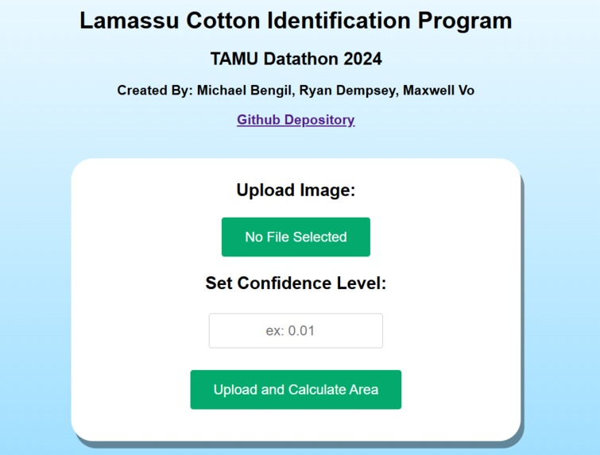
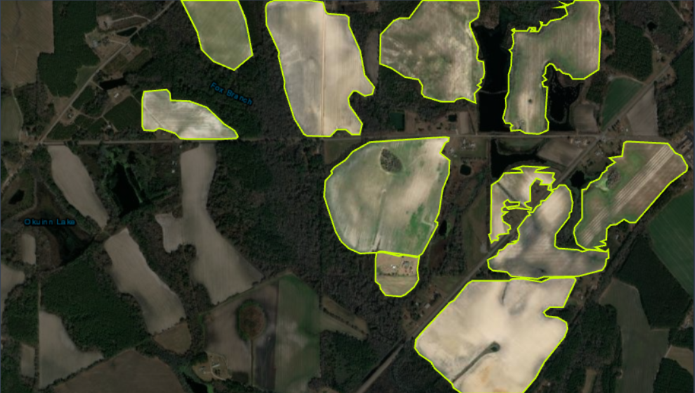
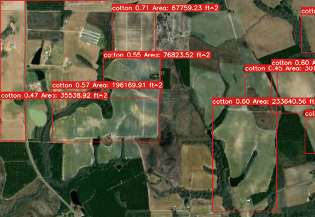
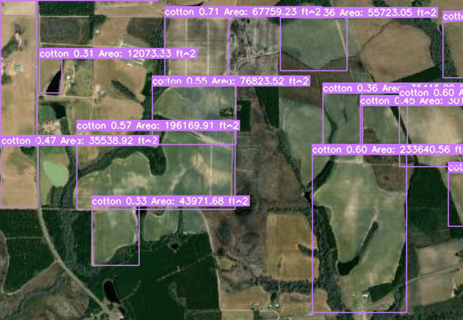
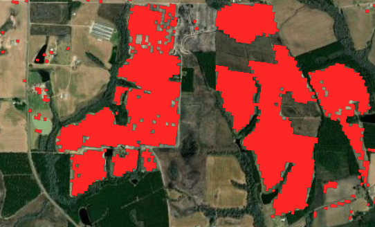

# lamassu-website
Website to interface with the ML model created from lamassu-satellite

For Python requirements, ensure flask is installed, and run `pip -r assets/requirements.txt` using the `requirements.txt` file in the `assets` directory

Once requirements are installed, run `python3 server.py` to run the flask server and website

Note: `images` directory only contains images for this README. They are not used for the site

# Project Overview

The following description is taken from our repo [here](https://github.com/Archan6el/lamassu-satellite/tree/main). Our presentation at the Datathon is also in said repo.

Our project aims to develop an AI-based tool to detect and identify cotton fields within satellite imagery for improved agricultural monitoring. Our tool was specifically developed for Coffee county in Georgia, US. 

Our group first used [RoboFlow](https://roboflow.com/) to label the cotton fields within satellite aerial photos. Obtaining said satellite images and how we determined which fields were cotton fields was through the [USDA CroplandCROS site](https://croplandcros.scinet.usda.gov/).

**Figure 1.** an example labeled image from our dataset

We then trained a YOLOv7 model with PyTorch, fine-tuning it to accurately recognize cotton fields in satellite images using our made dataset. After initial training, the model was evaluated and further adjusted to enhance its precision in detecting cotton fields based on labeled data. This refined model now serves as the core of our system, capable of analyzing new satellite images for cotton field detection.

Finally, we developed a straightforward Flask website as the front-end interface. This allows users to select an image file for analysis and set a confidence threshold for the model’s detections, providing an accessible way to engage with our model’s capabilities. The model outputs an image with identified cotton fields labeled, along with the model’s percent confidence and estimated area of said field. Example outputs are shown below.

 

**Figure 2.** Detection output with a 45% confidence threshold

**Figure 3.** Detection output with a 30% confidence threshold

**Figure 4.** True cotton field locations, marked in red, from the CroplandCROS web app

In regards to the scalability, our model is able to pretty accurately identify cotton fields, but with relatively low confidence intervals due to the small dataset. The model can definitely be expanded to be trained on a much larger dataset, improving accuracy of cotton field detection. Additionally, the model can be utilized in other counties outside of Coffee county, Georgia, due to this training. Lastly, the area calculation can be “tightened” and made to be more accurate, as our solution is relatively rudimentary due to time constraints. 

The development of this program can prove beneficial to the agriculture industry for a number of reasons. Firstly, with enough training, this program can outperform existing datasets like CroplandCROS, allowing for a more accurate and representative analysis of cotton fields in the United States. Secondly, the program can help farmers optimize resource allocation, further reducing waste and improving crop yields.
